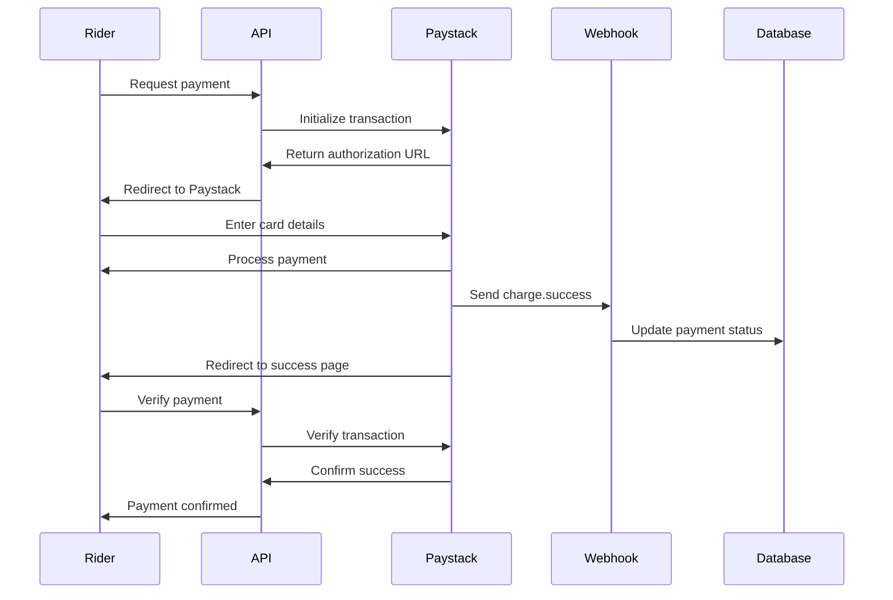

# Paystack Payment Integration

## Setup Complete ✅

Your Paystack payment integration is now configured with:

- **Secret Key**: `sk_test_a9f9bb469003bb62a585af63d47fa7bdbf587705`
- **Public Key**: `pk_test_3e87802dae281fbeb004f2b0f741a6e662aba103`
- **Webhook URL**: `https://chemotropic-albertha-contritely.ngrok-free.dev/api/webhooks/paystack`

## Environment Variables

Add these to your `.env` file:

```bash
PAYSTACK_SECRET_KEY=sk_test_a9f9bb469003bb62a585af63d47fa7bdbf587705
NEXT_PUBLIC_PAYSTACK_PUBLIC_KEY=pk_test_3e87802dae281fbeb004f2b0f741a6e662aba103
```

## Webhook Configuration

### In Paystack Dashboard:

1. Go to **Settings → Webhooks**
2. Add webhook URL: `https://chemotropic-albertha-contritely.ngrok-free.dev/api/webhooks/paystack`
3. Select events:
   - ✅ `charge.success` - Payment successful
   - ✅ `transfer.success` - Payout to driver successful
   - ✅ `transfer.failed` - Payout failed

## How It Works

### 1. Payment Initialization

When a rider completes a ride:

```typescript
POST /api/payments/process
{
  "rideId": "ride_id",
  "paymentMethod": "CARD",
  "email": "rider@example.com"
}
```

**Response:**
```json
{
  "payment": { "id": "...", "reference": "RIDE-xxx-123", "amount": 1500 },
  "authorization_url": "https://checkout.paystack.com/xxx",
  "access_code": "xxx"
}
```

### 2. Redirect to Paystack

Frontend redirects rider to `authorization_url` where they:
- Enter card details
- Complete payment
- Redirected back to your app

### 3. Webhook Verification

Paystack sends webhook to your URL:
- Signature verified using secret key
- Payment status updated in database
- Ride marked as completed

### 4. Payment Verification

After redirect, verify payment:

```typescript
GET /api/payments/process?reference=RIDE-xxx-123
```

## Payment Flow Example



## Testing Payments

### Test Cards

Use these test cards from Paystack:

**Successful Payment:**
```
Card Number: 4084 0840 8408 4081
CVV: 408
Expiry: Any future date
PIN: 0000
OTP: 123456
```

**Declined Payment:**
```
Card Number: 5060 6666 6666 6666
CVV: 123
Expiry: Any future date
```

### Test Flow

1. Create a test ride in the database
2. Call payment API with ride ID
3. Visit the `authorization_url`
4. Use test card above
5. Complete payment
6. Check webhook receives event
7. Verify payment status updated

## Frontend Integration

### Install Paystack Popup

```bash
npm install @paystack/inline-js
```

### Use in React Component

```typescript
'use client'

import { useState } from 'react'
import { usePaystackPayment } from '@paystack/inline-js'

export default function PaymentButton({ rideId, amount, email }) {
  const config = {
    reference: `RIDE-${rideId}-${Date.now()}`,
    email,
    amount: amount * 100, // in kobo
    publicKey: process.env.NEXT_PUBLIC_PAYSTACK_PUBLIC_KEY!,
  }

  const initializePayment = usePaystackPayment(config)

  const onSuccess = (reference) => {
    // Verify payment
    fetch(`/api/payments/process?reference=${reference.reference}`)
      .then(res => res.json())
      .then(data => {
        if (data.verified) {
          alert('Payment successful!')
        }
      })
  }

  const onClose = () => {
    alert('Payment cancelled')
  }

  return (
    <button 
      onClick={() => initializePayment(onSuccess, onClose)}
      className="btn-success"
    >
      Pay ₦{amount}
    </button>
  )
}
```

## Webhook Events

### charge.success

Triggered when payment is successful:
- Updates payment status to `COMPLETED`
- Marks ride as `COMPLETED`
- Records payment timestamp

### transfer.success

Triggered when driver payout succeeds:
- Updates driver earnings
- Marks transfer as completed

### transfer.failed

Triggered when driver payout fails:
- Logs error
- Notifies admin for manual intervention

## Security

### Signature Verification

All webhooks are verified using HMAC SHA512:

```typescript
const hash = crypto
  .createHmac('sha512', PAYSTACK_SECRET_KEY)
  .update(body)
  .digest('hex')

if (hash !== signature) {
  return // Invalid signature
}
```

### Best Practices

- ✅ Always verify webhooks
- ✅ Store secret keys in environment variables
- ✅ Use HTTPS for webhook URLs
- ✅ Verify payment on both webhook and frontend
- ✅ Handle failed payments gracefully

## Production Checklist

Before going live:

- [ ] Replace test keys with live keys
- [ ] Update webhook URL to production domain
- [ ] Test with real cards (small amounts)
- [ ] Set up email notifications for failed payments
- [ ] Implement retry logic for failed webhooks
- [ ] Add payment analytics
- [ ] Set up refund handling
- [ ] Configure business name in Paystack dashboard

## Troubleshooting

### Webhook not receiving events

1. Check ngrok is running: `ngrok http 3000`
2. Verify URL in Paystack dashboard
3. Check webhook logs in Paystack dashboard
4. Ensure signature verification is correct

### Payment initialization fails

1. Verify secret key is correct
2. Check amount is in kobo (multiply by 100)
3. Ensure email is valid
4. Check Paystack API status

### Payment stuck in pending

1. Check webhook received `charge.success`
2. Verify payment manually in Paystack dashboard
3. Call verify endpoint manually
4. Check database logs

## Support

- **Paystack Docs**: [https://paystack.com/docs](https://paystack.com/docs)
- **Test Cards**: [https://paystack.com/docs/payments/test-payments](https://paystack.com/docs/payments/test-payments)
- **API Reference**: [https://paystack.com/docs/api](https://paystack.com/docs/api)

---

**Your Paystack integration is ready to test!** 🎉
